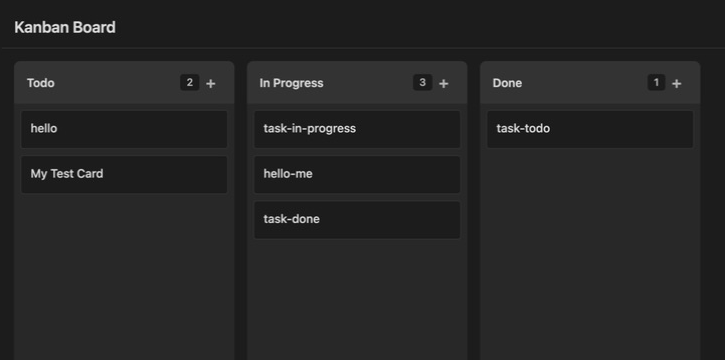
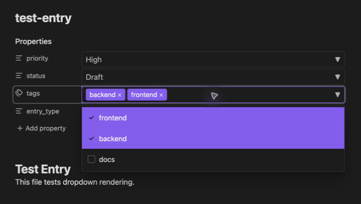

# Spicy Tools

An Obsidian plugin adding Kanban boards, dropdowns, and tagging to an Obsidian vault.

> [!NOTE]
> **No longer actively maintained.** Spicy Tools remains public as a portfolio of my work building Kanban boards and configurable dropdown interfaces for Obsidian. Updates and support are no longer planned. You're welcome to explore and fork the project under the MIT license.

## Screenshots

### Kanban board

Each card is a Markdown note. Moving it between columns updates its frontmatter status.



### Property dropdowns

Folder-defined options turn note properties into single-select dropdowns and multi-select tags.



These screenshots show the existing Kanban and dropdown example notes running in Obsidian.

## Features

### Spicy Dropdowns

Transform your frontmatter properties into dropdown selectors with:

- **Folder-based inheritance** - Define dropdowns in `_dropdowns.md` files, and child folders inherit parent definitions
- **Single and multi-select** - Support for both single values and arrays
- **Type preservation** - Numeric options stay numeric in frontmatter
- **Mismatch indicators** - Visual feedback when property values don't match available options
- **Table dropdowns** - Render markdown table columns as dropdowns in Reading View

### Kanban Boards

Turn any folder into a visual Kanban board:

- **File-as-card** - Each markdown file in the folder becomes a card
- **Drag-and-drop** - Move cards between columns, reorder within columns
- **Swimlanes** - Group cards horizontally with collapsible sections
- **Frontmatter-driven** - Column assignment based on a configurable property
- **Embedded boards** - Use code blocks to embed boards in any note

## Installation

### BRAT (Recommended)

1. Install [BRAT](https://github.com/TfTHacker/obsidian42-brat) from Community Plugins
2. Open BRAT settings and click "Add Beta Plugin"
3. Enter: `edwardhallam/spicy-tools`
4. Enable "Spicy Tools" in Settings > Community Plugins

### Manual Installation

1. Download `main.js`, `manifest.json`, and `styles.css` from the [latest release](https://github.com/edwardhallam/spicy-tools/releases)
2. Create folder: `<your-vault>/.obsidian/plugins/spicy-tools/`
3. Copy the downloaded files into that folder
4. Restart Obsidian
5. Enable "Spicy Tools" in Settings > Community Plugins

## Usage

### Spicy Dropdowns

Create a `_dropdowns.md` file in any folder:

````markdown
```yaml
status:
  options:
    - Draft
    - Review
    - Published

priority:
  options:
    - 1
    - 2
    - 3

tags:
  multi: true
  options:
    - frontend
    - backend
    - docs
```
````

All markdown files in that folder (and subfolders) will show dropdown selectors for these properties in the Properties panel.

### Kanban Boards

Create a `_board.md` file in any folder:

````markdown
```yaml
columnProperty: status
columns:
  - Todo
  - In Progress
  - Done
```
````

Opening `_board.md` will display the folder contents as a Kanban board. Cards can be dragged between columns, which updates the frontmatter property.

#### Embedded Boards

Embed a board in any note using a code block:

````markdown
```kanban
folder: Projects/MyProject
columnProperty: status
columns:
  - Todo
  - Done
```
````

## Development

```bash
# Install dependencies
pnpm install

# Development mode (CSS build + esbuild watch)
pnpm run dev

# Run tests
pnpm test

# Production build
pnpm run build
```

## Deployment

BRAT and manual installs consume the committed plugin bundle on `main`: `main.js`, `styles.css`, `manifest.json`, and `versions.json`.

Dependency PRs run CI, including `pnpm run build`, and CI fails if the generated bundle is stale. After a trusted push to `main`, the `Update Plugin Bundle` workflow runs tests, rebuilds the bundle, and commits updated generated assets back to `main` with the built-in `GITHUB_TOKEN` when the committed assets changed. No repo secret is required for this path.

## License

[MIT](LICENSE)
